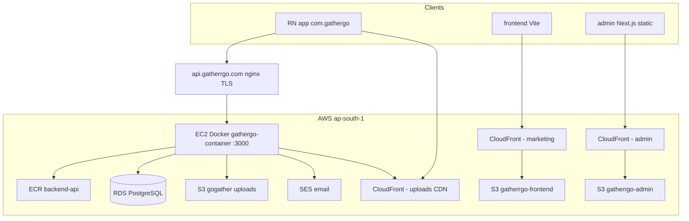

# GatherGo — AWS & Infrastructure Context

> **For Cursor / agents:** Read this file first for how GatherGo uses AWS.  
> **Secrets:** Never commit real keys. Use `AWS-CONTEXT.local.md` (gitignored) or `backend/.env` / GitHub Secrets.  
> **Live inventory:** Run the [Discovery commands](#discovery-commands-run-after-aws-configure) after `aws configure`.

---

## Security (read first)

- IAM access keys belong in **`~/.aws/credentials`** (CLI) and **`backend/.env`** on EC2 — not in this repo.
- If keys were pasted in chat, terminal logs, or screenshots: **rotate them in AWS IAM** → deactivate old key → create new key → update EC2 `.env` and GitHub repo secrets.
- GitHub Actions uses repository secrets: `AWS_ACCESS_KEY_ID`, `AWS_SECRET_ACCESS_KEY` (same IAM user or a dedicated CI user).

---

## High-level architecture



| Layer | Hosting | Notes |
|-------|---------|--------|
| **API** | EC2 + Docker | Image from ECR `092201262561.dkr.ecr.ap-south-1.amazonaws.com/backend-api`; container `gathergo-container`, port **3000**, env from `/home/ubuntu/Go-Gather/backend/.env` |
| **DB** | RDS PostgreSQL | Env: `AWS_RDS_*`; SSL in production when host contains `rds.amazonaws.com` |
| **Uploads** | S3 + CloudFront OAC | Live bucket **`gogather`** → CDN `d1fgu9uehmaf8u.cloudfront.net` (see `AWS-CONTEXT.local.md`); env `AWS_S3_BUCKET`, `AWS_CLOUDFRONT_DOMAIN` |
| **Marketing site** | S3 `gatherrgo-frontend` + CloudFront | Built in CI with `VITE_API_URL=https://api.gatherrgo.com` |
| **Admin** | S3 `gatherrgo-admin` + CloudFront | Built with `NEXT_PUBLIC_API_URL=https://api.gatherrgo.com` |
| **Email** | SES (+ optional Brevo) | `AWS_SES_FROM_EMAIL`; separate `AWS_SES_*` keys optional (fallback to general AWS keys) |
| **Push** | Firebase FCM (not AWS SNS in primary path) | `GOOGLE_APPLICATION_CREDENTIALS` or `FIREBASE_SERVICE_ACCOUNT_B64` on server |
| **Mobile** | No AWS in app binary | Hardcoded API: `https://api.gatherrgo.com` (`app/src/api/client.ts`) |

**AWS account ID (from deploy workflow):** `092201262561`  
**Region:** `ap-south-1` (Mumbai)

---

## How each package uses AWS

### `backend/` (primary AWS consumer)

| Service | Code | Env vars |
|---------|------|----------|
| **S3** | `src/utils/s3.util.js`, uploads across trips/events/users | `AWS_ACCESS_KEY_ID`, `AWS_SECRET_ACCESS_KEY`, `AWS_REGION`, `AWS_S3_BUCKET`, `AWS_CLOUDFRONT_DOMAIN` |
| **SES** | `src/utils/mailer.js` | `AWS_SES_FROM_EMAIL`, optional `AWS_SES_ACCESS_KEY_ID` / `AWS_SES_SECRET_ACCESS_KEY` |
| **SNS** | `src/utils/sns.js` (platform ARNs if used) | `AWS_SNS_PLATFORM_APP_ARN_IOS`, `AWS_SNS_PLATFORM_APP_ARN_ANDROID` |
| **RDS** | `src/config/database.js`, migrations | `AWS_RDS_HOST`, `AWS_RDS_PORT`, `AWS_RDS_DB`, `AWS_RDS_USER`, `AWS_RDS_PASSWORD` |

S3 uploads use **SSE-S3** so CloudFront OAC works (see comments in `s3.util.js`). Legacy direct S3 URLs are rewritten to CloudFront in auth/friends flows.

**Not AWS:** Gemini (`GEMINI_API_KEY`), Google/Microsoft OAuth, Branch.io, Firebase — still required in `backend/.env`.

Reference template: `backend/.env.example`.

### `frontend/` (marketing)

- **Build-time only:** `VITE_API_URL`, `VITE_CONTACT_RECEIVER_EMAIL` (set in `.github/workflows/frontend-deploy.yml`).
- **No AWS SDK** in the app; deploy uploads to S3 via GitHub Actions.
- **GitHub secret:** `CLOUDFRONT_FRONTEND_DISTRIBUTION_ID`.

### `admin/`

- **Build-time:** `NEXT_PUBLIC_API_URL` → production `https://api.gatherrgo.com`.
- Deploy to S3 bucket **`gatherrgo-admin`**; invalidate CloudFront.
- **GitHub secret:** `CLOUDFRONT_ADMIN_DISTRIBUTION_ID`.
- CORS: production API must include `https://admin.gatherrgo.com` in `ALLOWED_ORIGINS` (deploy script appends this on EC2).

### `app/` (React Native)

- **No AWS env vars.** Talks to `https://api.gatherrgo.com`.
- **Android network security:** `api.gatherrgo.com` in `network_security_config.xml`.
- Media/avatars come from API responses (CloudFront URLs from backend).

---

## CI/CD (GitHub Actions on `main`)

| Workflow | Trigger path | AWS usage |
|----------|--------------|-----------|
| `backend-deploy.yml` | `backend/**` | ECR push + SSH to EC2, pull image, `docker run --env-file .env` |
| `frontend-deploy.yml` | `frontend/**` | S3 sync `gatherrgo-frontend`, CloudFront invalidation |
| `admin-deploy.yml` | `admin/**` | S3 sync `gatherrgo-admin`, CloudFront invalidation |

### GitHub repository secrets (checklist)

| Secret | Used for |
|--------|----------|
| `AWS_ACCESS_KEY_ID` | All three deploy workflows |
| `AWS_SECRET_ACCESS_KEY` | All three deploy workflows |
| `EC2_HOST` | Backend SSH deploy |
| `EC2_USER` | Backend SSH (typically `ubuntu`) |
| `EC2_SSH_KEY` | Private key for SSH |
| `FIREBASE_SERVICE_ACCOUNT_B64` | Injected into EC2 `backend/.env` on deploy |
| `BREVO_*` | **Not** in GitHub — set once in EC2 `backend/.env` only (deploy leaves them unchanged) |
| `CLOUDFRONT_FRONTEND_DISTRIBUTION_ID` | Frontend cache invalidation |
| `CLOUDFRONT_ADMIN_DISTRIBUTION_ID` | Admin cache invalidation |

---

## Server: EC2, nginx, “firewall”

Production API is **not** Lambda — it is **Docker on EC2** behind **nginx** (TLS termination / reverse proxy to `:3000`).

Deploy workflow also ensures:

- `client_max_body_size 50M` in `/etc/nginx/conf.d/upload_limit.conf` for large uploads.

**Typical checks (outside repo):**

1. **EC2 security group:** inbound **443** (and **80** if redirect), SSH **22** restricted to your IP or CI only.
2. **RDS security group:** PostgreSQL **5432** only from EC2 security group (not `0.0.0.0/0`).
3. **S3 buckets:** public access blocked; CloudFront OAC for upload bucket; website buckets may use OAI/OAC for static hosting.
4. **CORS (`ALLOWED_ORIGINS` on EC2 `.env`):** should include at least:
   - `https://gatherrgo.com`
   - `https://www.gatherrgo.com`
   - `https://admin.gatherrgo.com`
   - Local dev origins if needed (`http://localhost:5173`, etc.)

---

## Local AWS setup

### 1. AWS CLI (your machine)

```powershell
aws configure
# Region: ap-south-1
# Output: json
```

Verify:

```powershell
aws sts get-caller-identity
aws s3 ls
aws rds describe-db-instances --region ap-south-1 --query "DBInstances[*].[DBInstanceIdentifier,Endpoint.Address]" --output table
aws cloudfront list-distributions --query "DistributionList.Items[*].[Id,DomainName,Origins.Items[0].DomainName]" --output table
```

### 2. Backend local `.env`

```powershell
cd backend
copy .env.example .env
# Fill AWS_*, RDS_*, JWT_*, OAuth, GEMINI_API_KEY, etc.
```

For local dev without RDS, use `docker-compose.yml` (Postgres container) and point `AWS_RDS_HOST=postgres`.

### 3. Cursor / agent local secrets file

Copy `AWS-CONTEXT.local.md.example` → `AWS-CONTEXT.local.md` and fill values. That file is **gitignored**.

---

## Discovery commands (run after `aws configure`)

Use these to fill `AWS-CONTEXT.local.md` with **live** IDs (do not commit output with secrets):

```powershell
# Identity
aws sts get-caller-identity

# S3 buckets (expect gathergo-uploads, gatherrgo-frontend, gatherrgo-admin, gathergo-releases, etc.)
aws s3 ls

# RDS endpoint
aws rds describe-db-instances --region ap-south-1

# CloudFront → map to AWS_CLOUDFRONT_DOMAIN and GitHub distribution IDs
aws cloudfront list-distributions --query "DistributionList.Items[*].{Id:Id,Domain:DomainName,Origin:Origins.Items[0].DomainName}" --output table

# ECR
aws ecr describe-repositories --region ap-south-1

# SES verified identities
aws ses list-identities --region ap-south-1

# EC2 (API host)
aws ec2 describe-instances --region ap-south-1 --filters "Name=instance-state-name,Values=running" --query "Reservations[*].Instances[*].[InstanceId,PublicIpAddress,Tags[?Key=='Name'].Value|[0]]" --output table
```

---

## When you change AWS / infra — what to update

| Change | Update |
|--------|--------|
| New IAM access key | `~/.aws/credentials`, EC2 `backend/.env`, GitHub `AWS_*` secrets |
| New S3 upload bucket or CloudFront domain | EC2 `backend/.env`: `AWS_S3_BUCKET`, `AWS_CLOUDFRONT_DOMAIN`; S3 bucket policy + CloudFront OAC |
| New RDS instance | EC2 `backend/.env`: `AWS_RDS_*`; security group; run migrations on deploy |
| New API domain | DNS → EC2/nginx, `GOOGLE_*_REDIRECT_URI`, mobile `client.ts`, `network_security_config.xml`, `ALLOWED_ORIGINS`, frontend/admin `*_API_URL` in workflows |
| New marketing/admin CDN | GitHub `CLOUDFRONT_*_DISTRIBUTION_ID`, DNS CNAME to CloudFront |
| SES new sender domain | Verify domain in SES, `AWS_SES_FROM_EMAIL`, possibly SPF/DKIM DNS |

**Usually no change:** `app/` for pure S3/CloudFront/CDN URL changes (backend returns new URLs). **Exception:** API base URL, deep links, or certificate pinning.

---

## Domains (production intent)

| Purpose | URL |
|---------|-----|
| API | `https://api.gatherrgo.com` |
| Marketing | `https://www.gatherrgo.com` / `https://gatherrgo.com` |
| Admin | `https://admin.gatherrgo.com` |
| App deep links | `https://gatherrgo.com/invite/*` (served by the marketing site, Universal/App Links), `gathergo://` (custom-scheme fallback) |
| Uploads CDN | `AWS_CLOUDFRONT_DOMAIN` (set in server `.env`) |

---

## Related files

- `backend/.env.example` — full backend env template
- `backend/src/config/index.js` — env → config mapping
- `backend/src/config/aws.js` — S3 / SES / SNS clients
- `.github/workflows/backend-deploy.yml` — ECR + EC2 deploy
- `.github/workflows/frontend-deploy.yml` — S3 + CloudFront
- `.github/workflows/admin-deploy.yml` — S3 + CloudFront
- `README.md` — repo overview

---

## Agent quick-start prompt

When asking Cursor to change infra or env, attach:

1. This file: `@AWS-CONTEXT.md`
2. Your filled (local only): `@AWS-CONTEXT.local.md`
3. Task-specific paths, e.g. `@backend/.env.example`

Example: *“Using AWS-CONTEXT.md and my local secrets file, verify EC2 .env has the correct CloudFront domain and list any frontend/admin workflow changes needed.”*
