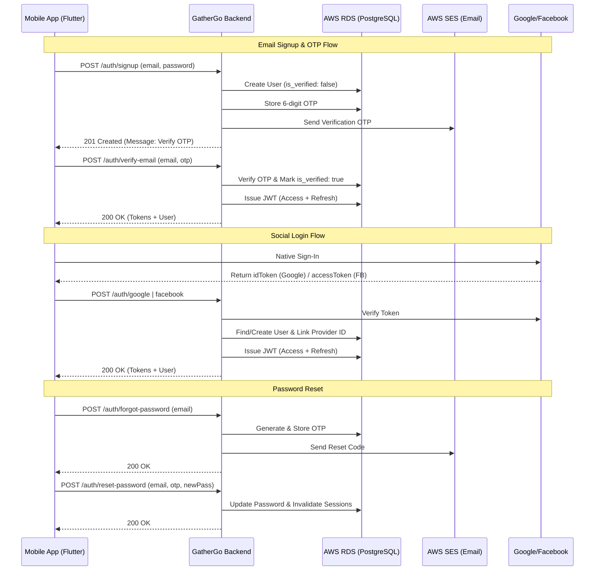

# 🌍 GatherGo — Backend (Milestone 1)

Welcome to the GatherGo backend! This is a Node.js + Express.js API designed for Milestone 1 (Authentication & User Profiles). It uses PostgreSQL on AWS RDS, S3 for storage, SES for email (OTPs), and SNS for push notifications.

---

## 🔐 Auth Flow (Mermaid Chart)



---

## 🚀 Getting Started

### 1. Prerequisites
- Node.js (v18+)
- PostgreSQL (Local or AWS RDS)
- AWS Account (S3, SES, SNS)

### 2. Installation
```bash
npm install
```

### 3. Environment Setup
Copy the `.env.example` to `.env` and fill in your credentials.
```bash
cp .env.example .env
```

### 4. Database Migrations
```bash
npm run migrate
```

### 5. Start the Server
```bash
# Development
npm run dev

# Production
npm start
```

---

## 🛠️ API Documentation (Postman)

We provide a complete Postman collection for all Milestone 1 endpoints.

1.  Locate the file: `GatherGo_M1.postman_collection.json` in this folder.
2.  Open Postman -> **Import** -> Select this file.
3.  Set the `base_url` variable in the collection (defaults to `http://localhost:3000`).
4.  After verification, paste your `accessToken` into the `access_token` variable to test authenticated routes.

### Enpoint Summary (M1)

| Route | Method | Description | Auth Required |
| :--- | :--- | :--- | :--- |
| `/auth/signup` | POST | Register with Email/Password | NO |
| `/auth/verify-email` | POST | Verify 6-digit OTP after signup | NO |
| `/auth/login` | POST | Login and receive JWT tokens | NO |
| `/auth/google` | POST | Exchange Google Token for JWT | NO |
| `/auth/facebook` | POST | Exchange Facebook Token for JWT | NO |
| `/auth/resend-otp` | POST | Resend verification or reset code | NO |
| `/auth/forgot-password`| POST | Request 6-digit reset code | NO |
| `/auth/reset-password` | POST | Reset password using OTP | NO |
| `/auth/refresh` | POST | Get new tokens using Refresh Token | NO |
| `/auth/logout` | POST | Invalidate refresh token | YES |
| `/auth/me` | GET | Current user & profile info | YES |
| `/users/profile` | POST | Save/Update profile details | YES |
| `/users/photo` | PUT | Upload profile photo to S3/CDN | YES |
| `/users/:id` | GET | Fetch public user profile | NO |

---

## 🧪 Testing

```bash
npm test
```
Tests are written in Jest and use fully mocked databases and AWS services.

---

## 📦 Tech Stack
- **Runtime**: Node.js + Express.js
- **Database**: PostgreSQL (AWS RDS)
- **Storage**: AWS S3 + CloudFront CDN
- **Email/SMS**: AWS SES
- **Push Notifications**: AWS SNS
- **Auth**: Google & Facebook OAuth + JWT
- **Validation**: express-validator
- **Security**: bcryptjs, helmet, cors
